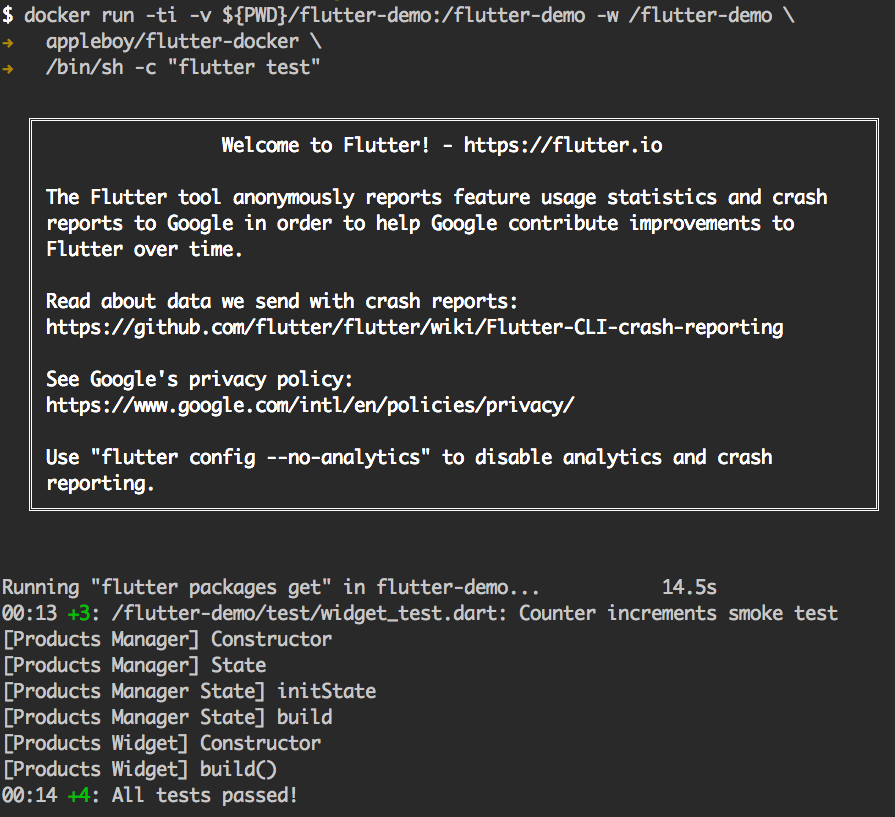

# flutter-docker


[](https://cloud.drone.io/appleboy/flutter-docker)


Unit testing for flutter in Docker. See the detail section about『[Introduction to unit testing](https://flutter.io/docs/cookbook/testing/unit)』.

## How to use

download the docker image: `1.0.0` for flutter 1.0.0 stable version.

```
$ docker pull appleboy/flutter-docker:1.0.0
```

Download your flutter app source code.

```
$ git clone https://github.com/appleboy/flutter-demo.git
$ docker run -ti -v ${PWD}/flutter-demo:/flutter-demo -w /flutter-demo \
  appleboy/flutter-docker:1.0.0 \
  /bin/sh -c "flutter test"
```


